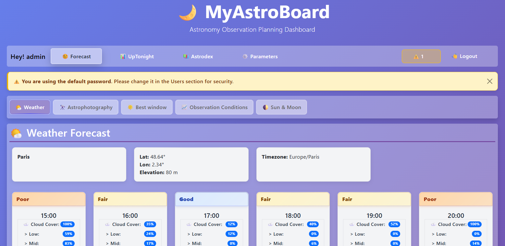
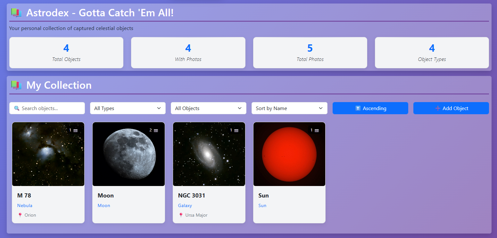

> [!WARNING]
> This repo is currently in early stage! Be really carefull, lot of things unexpected can happen!

# 🌙 MyAstroBoard

Fully integrated web dashboard interface easy to set-up with Docker.

Automated UpTonight execution, based on the [mawinkler/uptonight](https://github.com/mawinkler/uptonight) project, with nice result display.

> [!TIP]
> Want quickly look interface? Check [the Visual Tour!](docs/VISUAL_TOUR.md)

## 🌟 Features

### Core Features
- **Astrodex**: Personal collection system for astrophotography - track objects you've captured, manage photos with detailed metadata, and build your celestial catalog
- **Weather Forecast**: Real-time weather forecasts using Open Meteo
- **Observation Conditions**: Usefull graph trend for astro observation
- **Moon & Sun informations**: Informations on moon & sun, with local calculation
- **Lunar & Solar Eclipse**: Informations for next lunar and solar eclipse
- **Aurora prediction**: forecast potential aurora
- **ISS passes**: Iss Pass scheduler
- **Easy configuration**: Interface to configurate easily UpTonight settings (location, catalogues, targets, ...)
- **Multiple catalogues calculation**: Browse celestial objects from UpTonight's catalogues (Messier, Herschel400, OpenNGC, LBN, LDN, etc.)
- **Dynamic Environment settings**: Pressure, Temperature, Relative Humidity based on Open Meteo
- **Multilanguage**: based on i18n, currently English, and French implemented as human translation, Spanish & Deutch as G-translate.

### Modern UI/UX
- **Tabbed Interface**: Organized sections for Weather, UpTonight, Astrodex, Configuration
- **Per-Catalogue View**: Separate view for each catalogue
- **Sortable Tables**: Filter and sort observation targets by quality (foto score)
- **Image Popups**: View plots and charts in modal dialogs
- **Log Viewer**: Real-time system log viewing and filtering
- **Responsive Design**: Works on desktop, tablet, and mobile devices

### Automation & Docker
- **Automated Execution**: Scheduled uptonight runs (configurable interval), with weather environment updated
- **Per-Catalogue Processing**: Separate execution for each catalogue
- **Version Control**: Be notified if a new version is available

### Astrodex: Your Astrophotography Collection
Astrodex is your personal tracker for every celestial object you've captured. Browse your collection with detailed metadata and imaging information.

### Plan My Night: Build Your Observation Timeline
Plan My Night helps you transform UpTonight targets into a practical session timeline for the current astronomical night.

- Build an ordered target list for your night session
- Set per-target photo durations in HH:MM
- Reorder targets quickly to match your real observing strategy
- Track timeline progress and current target during the night
- Export your plan as CSV or PDF for field use

### Equipment Profiles System
- **Telescope profiles**: focal length, aperture, type
- **Camera profiles**: sensor size, pixel size, ...
- **Mount profiles**: payload capacity, tracking accuracy
- **Filter profiles**: transmission curves, narrowband
- **Field of view calculator**
- **Equipment combination** recommendations
- **Useable for Astrodex**

## 🚀 Quick Start

Maybe now you want install it, and run it ! So you can consult the quick documentation:

- [Installation Guide](docs/1.INSTALLATION.md) - How to install and run MyAstroBoard
- [Quick Start](docs/2.QUICKSTART.md) - Get up and running in 5 minutes
- [Update Guide](docs/3.UPDATE.md) - How to update to the latest version
- [Reverse Proxy & HTTPS Setup](docs/REVERSE_PROXY.md) - Deploy behind NGINX Proxy Manager, Traefik, or other reverse proxies
- [Release Guide](docs/4.RELEASE.md) - How to publish new versions (for maintainers)

## Views

Take a look to [Visual Tour](docs/VISUAL_TOUR.md) !

## 📦 Dependencies

All dependencies are listed on [requirements.txt](requirements.txt)

## 🏷️ Versioning

This project uses [Semantic Versioning](https://semver.org/):
- **MAJOR** version for incompatible API changes
- **MINOR** version for backwards-compatible functionality additions
- **PATCH** version for backwards-compatible bug fixes

Current version: See [VERSION](VERSION) file

### Docker Image Tags

Images are published to GitHub Container Registry (ghcr.io):
- `latest`: Latest stable release from main branch
- `v1.0.0`: Specific version tag
- `v1.0`: Minor version tag (auto-updates to latest patch)
- `v1`: Major version tag (auto-updates to latest minor/patch)

## 🐳 Docker-in-Docker

The system uses Docker-in-Docker to run uptonight containers. This requires:
- Access to `/var/run/docker.sock`
- Privileged mode (or appropriate Docker socket permissions)
- Docker CLI installed in the container

## 🤝 Contributing

Contributions are welcome! Please feel free to submit a Pull Request.

## 📄 License

This project is open source and available under the AGPL-3.0 License.
Copyright (C) 2025-2026 WorldOfGZ and contributors.

In accordance with AGPL-3.0 requirements for network use, the corresponding source code for deployed versions is available in this repository:
https://github.com/WorldOfGZ/myastroboard

## 🙏 Acknowledgments

- Uptonight informations are based on [mawinkler/uptonight](https://github.com/mawinkler/uptonight) by Michael Winkler
- Uses target catalogues from the uptonight repository
- Integrates with the uptonight Docker container for astronomy calculations

### About original UpTonight config file

Some of proprieties on config files are not managed, and currently not planned to be :

- `mqtt` is not planned to be implemented
- `live_mode` value will be always `false`
- `prefix` value will remains unconfigured
- `type_filter` value will remains unconfigured, filtering can be done on dashboard
- `output_datestamp` value will be always `false`

## 📞 Support

For issues and feature requests, please use the [GitHub Issues](https://github.com/WorldOfGZ/myastroboard/issues) page.
