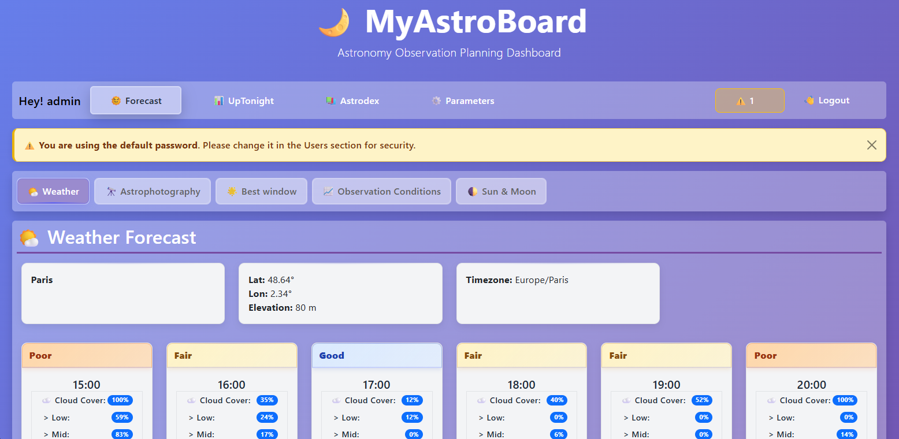
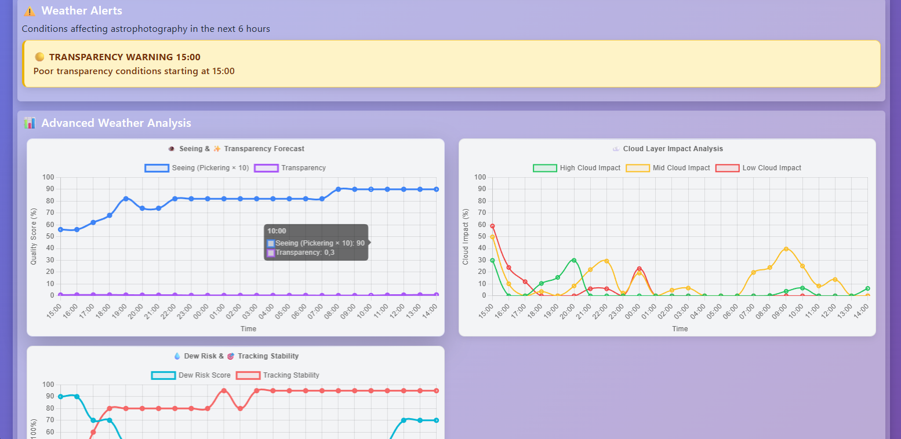
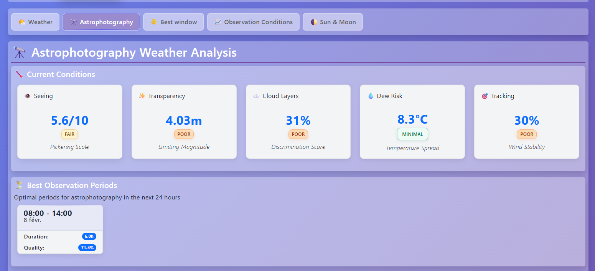
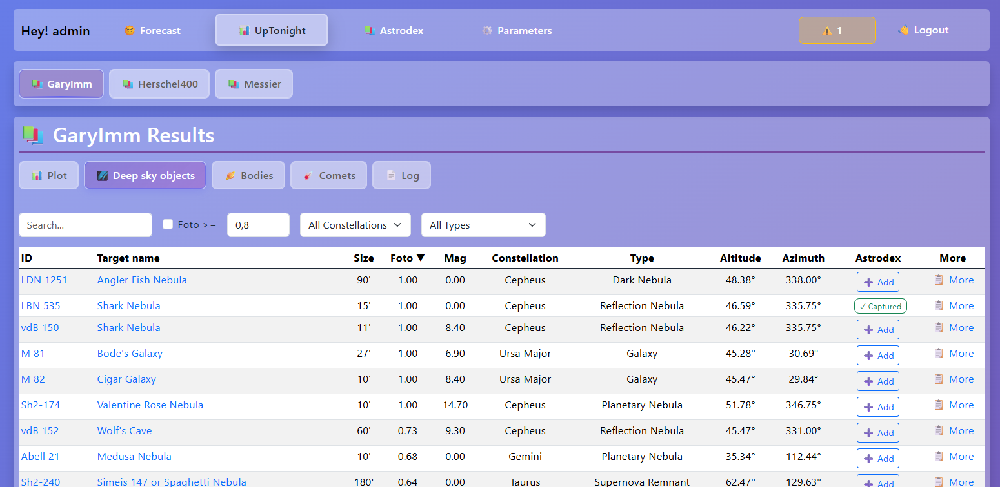
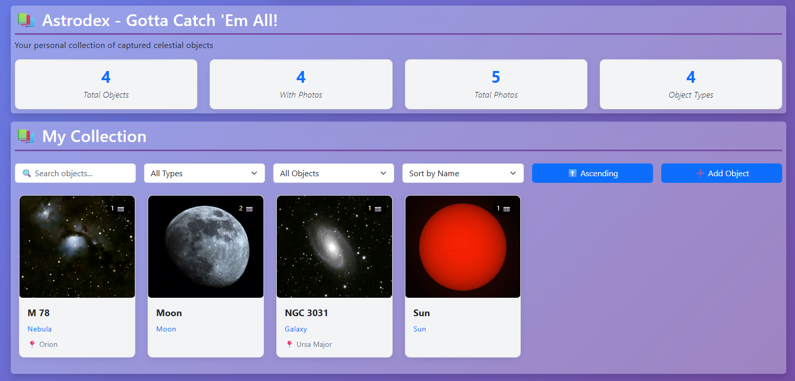
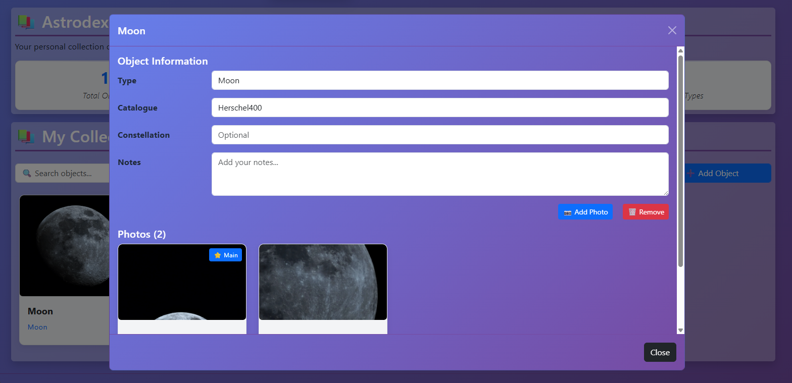
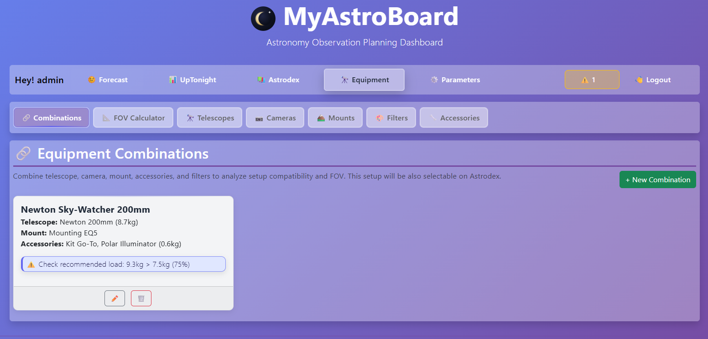
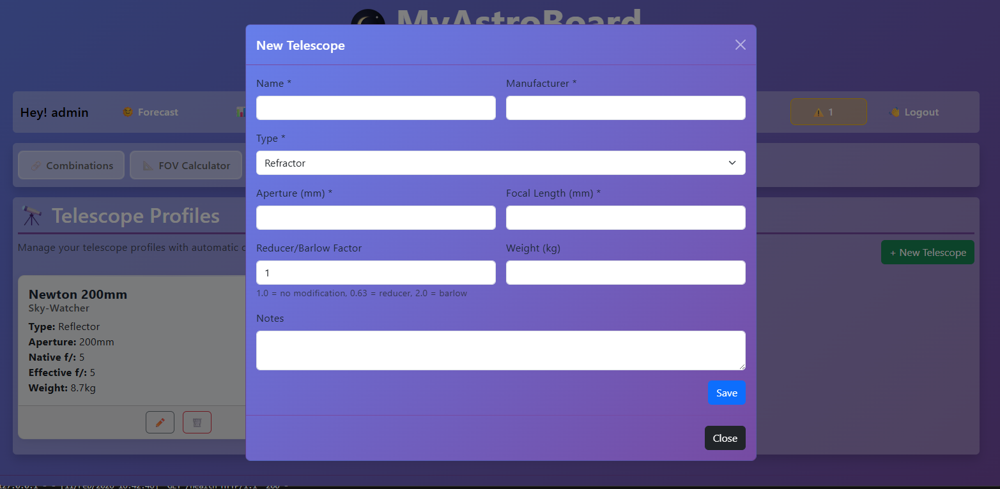
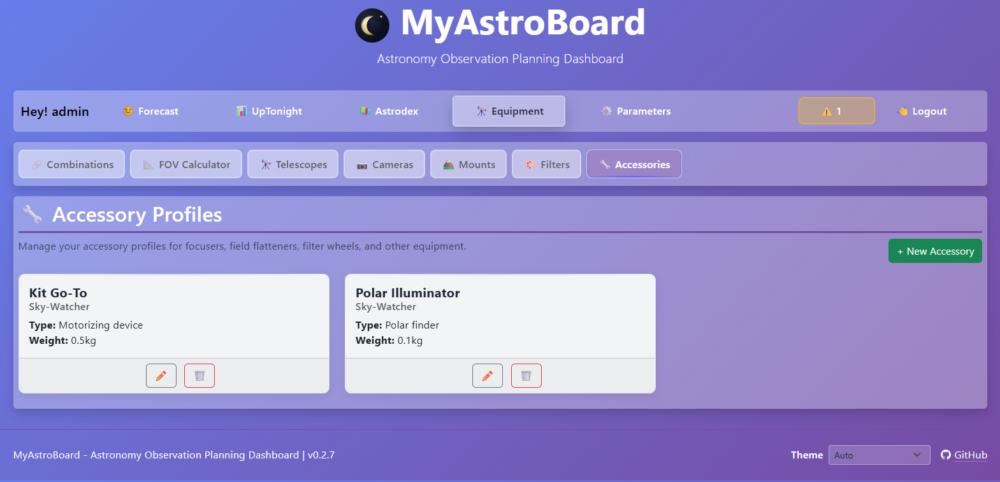

# 📸 MyAstroBoard - Visual Tour

A visual walkthrough of MyAstroBoard's interface and capabilities.

## Table of Contents
1. [Dashboard](#dashboard)
2. [Weather & Conditions](#weather--conditions)
3. [Celestial Objects](#celestial-objects)
4. [Astrodex Collections](#astrodex-collections)
5. [Equipment Profiles](#equipment-profiles)
6. [Advanced Features](#advanced-features)

---

## Dashboard

### Home Screen
Your command center for all astronomy activities. The home dashboard provides quick access to current weather, observation conditions, and upcoming observation opportunities.

---

## Weather & Conditions

### Weather Forecast
Detailed weather information including temperature, precipitation, cloud cover, and atmospheric conditions optimized for night-time astronomy.

### Observation Conditions Monitor
Real-time graphs of atmospheric conditions including transparency, seeing, and other factors critical for successful observations.

### Alerts & Advanced Weather Analysis
Comprehensive weather alerts and advanced forecast charts to help you plan your observation sessions with confidence.

### Astrophotography advanced information
Quick information, and detailled information about weather from astrophoto side.

---

## Celestial Objects

### Sun & Moon Information
Detailed calculations of solar and lunar positions, phases, rise/set times, and altimetry data perfect for planning your observations.

### Deep Sky Objects Catalogue from UpTonight
Browse thousands of deep-sky objects from multiple catalogues with detailed information and observation quality scoring.

### Celestial Bodies View from UpTonight
Explore celestial bodies with detailed information, ratings, and observation recommendations.

### Altitude Charts from UpTonight
Charts showing object altitude versus time, helping you identify optimal observation windows.

---

## Astrodex Collections

### Your Astrophotography Collection
Astrodex is your personal tracker for every celestial object you've captured. Browse your collection with detailed metadata and imaging information.

### Object Editor Interface
Manage detailed information about each capture including:
- Target object name and coordinates
- Capture date and equipment
- Processing notes and observations
- Atmospheric conditions at time of capture

### Astrophotography Metadata
Track comprehensive imaging details:
- Exposure settings (shutter speed, ISO, aperture)
- Equipment used (telescope, camera, filters)
- Post-processing notes
- Observing conditions (transparency, seeing, temperature)
- Personal observations and improvements for next time

---

## Equipment Profiles

Create your complete equipement catalogue to see details, and pre-fill fields in Astrodex.

### Manage your equipment
Manage completely your equipment: 
- Telescopes
- Camera
- Mounting
- Filters
- Accessories
- **Combine all these elements to create a equipment**

---

## Advanced Features

### Smart Scheduling
- Automated UpTonight execution with configurable intervals
- Per-catalogue processing for multiple target lists
- Weather updates before each processing run
- Version notifications and update management

### Configuration System
- Easy setup of location and coordinates
- Catalogue selection and filtering
- Custom target list management

### Data Analytics
- Historical trend analysis
- Observation success metrics
- Weather pattern recognition
- Clear night predictions

### Mobile Responsive
All features work seamlessly on:
- Desktop computers
- Tablets
- Mobile devices
- Any modern web browser

---

## 🎯 Start Your Journey

New to MyAstroBoard? Follow these steps:

1. **Install**: See [Installation Guide](1.INSTALLATION.md)
2. **Configure**: Set up your location and preferences
3. **Explore**: Browse celestial objects using the catalogues
4. **Plan**: Check weather and conditions for observation sessions
5. **Track**: Build your Astrodex collection of captures

---

## 💡 Pro Tips

- Use the weather and conditions dashboards together to find optimal observation windows
- Check altitude charts to ensure targets will be well-positioned in your sky
- Log your captures in Astrodex to build a comprehensive imaging record
- Set up automated catalogue updates to always have fresh target data
- Configure alerts for good observation nights so you never miss clear skies

---

*Explore the cosmos with MyAstroBoard - Your personal astronomy command center!*
